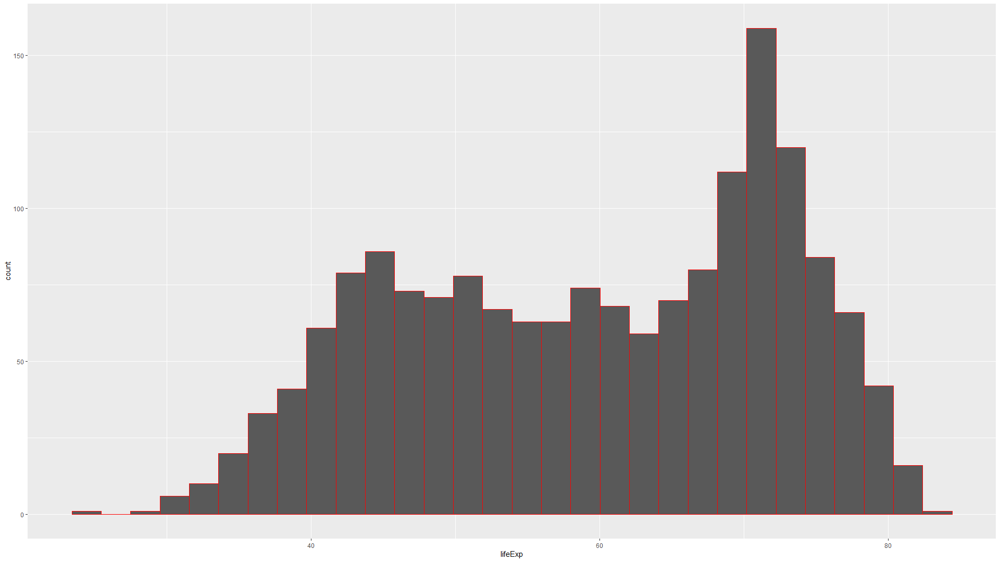
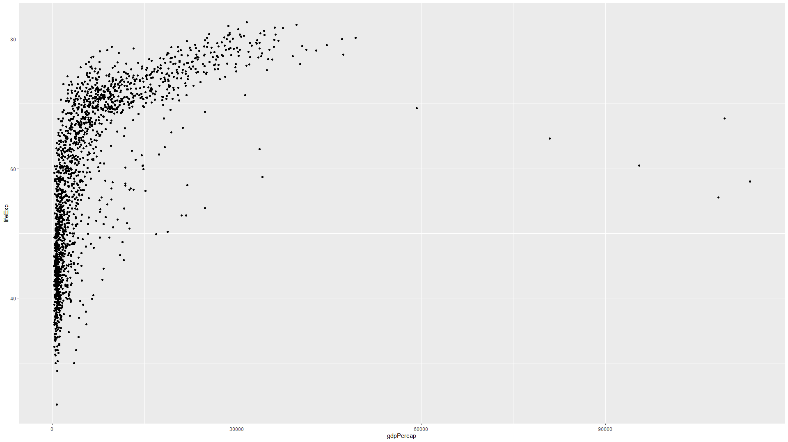

# Statistics using R

[](https://github.com/sindresorhus/awesome)


Performed some awesome statistical methods using R. The dataset used is gapminder provided through r package.

## Tech Stack


## Download

```bash
  git clone https://github.com/adionamission/Statistics-using-R.git
```

## NULL hypothesis

NULL hypothesis means when the difference is 0 or negligible.

## P-value

Probability of how correct is the NULL hypothesis. Value lies b/w 0 to 1.

## Scenario 1

Calculating mean, median, standard deviation and plotting some baisc graphs. Also did some data transformation.

Graphs

 - Histogram

 

 In the below graph, the histogram is right-skewed, so applied transformation in x-axis.

 
 
 In the below graph, the data is normally distributed and thus forming a normal curve.

 

 - Boxplot

 

 - Scatter Plot

 

 In the below graph, the scatter plot now looks more linear due to transformation applied on x-axis.

 

## Scenario 2

Used chi-square test to perform feature selection. 

When a feature is independent, the observed count is close to the expected count and therefore the p-value will be more closer to 1.

If p-value is less than 0.05 we can reject NULL hypothesis.

| Scens          | Data    |
| ----------------- | --------|
| Observed | 28.801 |
| Expected | 59.47444 |

## Scenario 3

T-test was conducted on a group of dataset i.e South Africa and Ireland.

The t-test showed that the difference between mean lifeExp b/w Ireland and South Africa is not 0. This means we can reject NULL hypothesis.

The p-value showed what is the probability of NULL hypothesis to be correct which was extremely close to 0. Therefore, we can reject NULL hypothesis.


## Scenario 4

Performed z-test on IQ levels of individual from cityA and cityB and compared there mean to know if there is any difference and if there is, is it by chance?

## Scenario 5

Conducted ANOVA test on the group of dataset i.e South Africa and Ireland to check the difference in mean and if is it by chance.

As per the results, p < 0.05

Therefore we can reject NULL hypothesis which means there is actually a difference in the mean of lifeExp.

## Scenario 6

Applying standardization and normalization in the column pop.

Normalization normlize the value between a range.

Standardization put the values on a same scale with no range limitation. Therefore, outliners won't get affected.

Still A/B testing should be applied to see which gives the best results because sometimes outliners can affect accuracy in woring way or sometimes not.

## Scenario 7

Correlation and Covariance are implemented.

Correlation states how variables are related.

In correlation, used 3 methods that are:

 - Pearson
 - Spearman
 - Kendall

Covariance states how variables differ.

Correlation test was also implemeted to see if we got the result by chance.


## Scenario 8

Applied random sampling and took 10 random samples from the population with and without replacement.

With replacement means allowing dupicate values.

Without replacement means not allowing duplicate values.

## Scenario 9

Implemented bootstrapping.

The new dataset created using sampling with replacement so that it has the same number of values as the original dataset is called Bootstrap dataset.

Process of creating bootstrap dataset, then calculating mean (or median or standard deviation or regression weights) and keeping track of those records is called Bootstrapping.

Bootstrap samples (or replication) is the new number line where we add the data from the previous number line.


The dashed line in the above graph is the original r-squared value.

The histogram showed what will be the result if we test regression multiple times on a random sample from the population measured by r-squared having same dependent and independent variable as testing regression multiple test is like doing hit and trial method which is very time consuming.

The 95% confidence interval is between 0.2520 to 0.4219 as per BCA type interval. This does not cover 0 and therefore is we can reject NULL hypothesis.

Bootstrapping confidence interval types:

 - <b>Normal bootstrap</b> = Using the standard deviation for calculation of CI.
 - <b>Basic bootstrap</b> = Using percentile to calculate upper and lower limit of test statistic.
 - <b>Percentile bootstrap</b> = Using quantiles eg 2.5%, 5% etc. to calculate the CI. 
 - <b>Bias Corrected Accelerated (BCa)</b> = Using percentile limits with bias correction and estimate acceleration coefficient corrects the limit and find the CI. 
 
## Scenario 10

Implemented binomial distribution.

It is used when there are 2 mutually exclusive outcomes.

In this case, suppose there are 30 patients out of which may be 5 (we don't know which 5) are COVID19 positive and remaining are COVID19 negative patients.

We need to find probability of COVID19 positive patients.

For this task, dbinom() function has been used as it specifies probability density and the 5 patients are choosed using random sampling.

